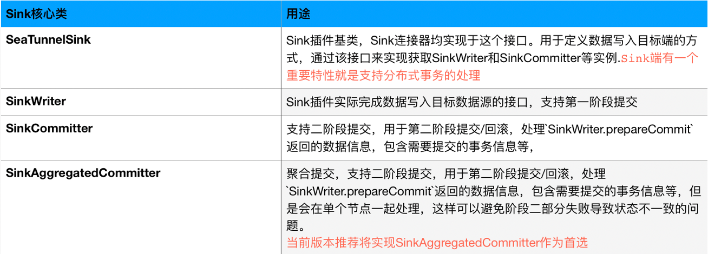
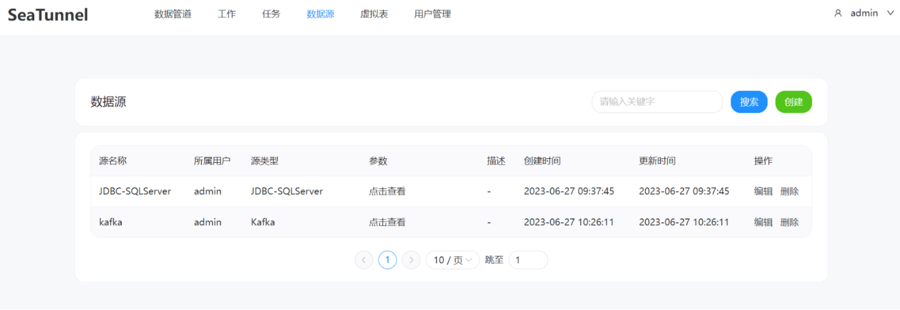

## 产品概述
Apache SeaTunnel 是一个非常易用的超高性能分布式数据集成产品，支持海量数据的离线及实时同步。每天可稳定高效同步万亿级数据，已应用于数百家企业生产，也是首个由国人主导贡献到 Apache 基金会的数据集成顶级项目。

SeaTunnel 主要解决数据集成领域的常见问题：

* **数据源多样**：常用的数据源有数百种，版本不兼容。随着新技术的出现，出现了更多的数据源。用户很难找到能够全面快速支持这些数据源的工具。

* **复杂同步场景**：数据同步需要支持离线-全量同步、离线-增量同步、CDC、实时同步、全库同步等多种同步场景。

* **资源需求高**：现有的数据集成和数据同步工具往往需要大量的计算资源或JDBC连接资源来完成海量小表的实时同步。这在一定程度上加重了企业的负担。

* **缺乏质量和监控**：数据集成和同步过程经常会丢失或重复数据。同步过程缺乏监控，无法直观了解任务过程中数据的真实情况。

* **技术栈复杂**：企业使用的技术组件各不相同，用户需要针对不同的组件开发相应的同步程序来完成数据集成。

* **管理维护困难**：市面上的数据集成工具通常受限于不同的底层技术组件（Flink/Spark），使得离线同步和实时同步往往是分开开发和管理的，增加了管理和维护的难度。

SeaTunnel 产品实现了高可靠性、集中管理、可视化监控等一体的数据集成统一平台。

平台可以实现了标准化、规范化、界面化操作；实现了数据同步高速化，全量到增量无锁化自动切换，目前已经支持 100+ 种数据源；支持整库同步、表结构自动变更；同时无中心化设计确保系统的高可用机制，整体上做到简单易用，开箱即用。

## 同类产品横向对比
### 2.1、高可用、健壮的容错机制
DataX 只支持单机，SeaTunnel 和 Flink CDC 支持集群，因此在高可用上 DataX 是不支持的，DataX由于单机设计很易受网络闪断、数据源不稳定等因素的影响造成数据不一致问题。

Apache SeaTunnel具有无中心化的高可用架构设计和完善的容错机制，SeaTunnel支持更细粒度的作业回滚机制，结合多阶段提交与CheckPoint机制，确保数据一致的同时避免大量回滚导致性能下降

Flink CDC采用主从模式的架构设计，容错粒度较粗，多表同步时，Flink 任何表出现问题都会导致整个作业失败停止，导致所有表同步延迟。

在高可用维度上，SeaTunnel 和 Flink CDC 优势很大

### 2.2、部署难度和运行模式
* Apache SeaTunnel 和 DataX 部署都十分容易。
* Flink CDC 的部署难度中等，但因为它依赖于 Hadoop 生态系统， 所以部署相对 SeaTunnel 会复杂一些。

### 2.3、支持的数据源丰富度
* Apache SeaTunnel 支持 MySQL、PostgreSQL、Oracle、SQLServer、Hive、S3、RedShift、HBase、Clickhouse 等 100 多种数据源。

* DataX 支持 MySQL、ODPS、PostgreSQL、Hive 等 20 多种数据源。

* Flink CDC 支持 MySQL、PostgreSQL、MongoDB、SQLServer 等 10 多种数据源

Apache SeaTunnel 支持关系型数据库、NOSQL 数据库、数据仓库、实时数仓、大数据、云数据源、 SAAS、消息队列、标准接口、文件、FTP等多种数据源同步,数据可以同步到任一指定的系型数据库、NOSQL 数据库、数据仓库、实时数仓、大数据、云数据源、 SAAS、标准接口、消息队列、文件等目标数据源中,满足政府、企事业单位对于数据流动的绝大多数需求。在这个维度的对比上，显然 SeaTunnel 支持的数据源丰富度是远远高于其他两个的。

### 2.4、内存资源占用
* Apache SeaTunnel 占用较少的内存资源，SeaTunnel Zeta 引擎的 Dynamic Thread Sharing 技术可提高 CPU 利用率，不依赖 HDFS，Spark 等复杂组件，具备更好单机处理性能。

* DataX 和 Flink CDC 会占用较多的内存资源， Flink CDC 每个作业只能同步一张表，多张表同步需要启动多个 Job 运行，造成巨大浪费资源。

### 2.5、数据库连接占用
* Apache SeaTunnel 占用较少的数据库连接，支持多表或整库同步，解决 JDBC 连接过多的问题； 同时实现了 zero-copy 技术，无需序列化开销。

* DataX 和 Flink CDC 占用较多的数据库连接，他们每个 Task 只能处理一张表，每张表至少需要一个JDBC 连接来读取或写入数据。当进行多表同步和整库同步时，需要大量的 JDBC 连接。

这通常是 DBA 们十分关注的，数据同步不能影响业务库正常运行，所以控制连接数占用是十分必要的。

### 2.6、自动建表
* Apache SeaTunnel 支持自动建表。

* DataX 和 Flink CDC 不支持自动建表。

### 2.7、整库同步
* Apache SeaTunnel 设计有支持整库同步，方便用户使用，不需要为每张表都写一遍配置。

* DataX 和 Flink CDC 不支持整库同步，每个表需要单独配置。

试想一下当你有数百张表，每张都单独配置一遍是不是还是太费劲了些！

### 2.8、断点续传
断点续传功能在数据同步过程是十分实用的功能，支持断点续传将让数据同步在手动暂停或出问题时能快速恢复继续，Apache SeaTunnel 和 Flink CDC 可以支持断点续传，但 DataX 不支持断点续传。

### 2.9、多引擎支持
* Apache SeaTunnel 支持 SeaTunnel Zeta、Flink 和 Spark 三个引擎选其一作为运行时。

* DataX 只能运行在 DataX 自己的引擎上。

* Flink CDC 只能运行在 Flink 上。

在引擎支持丰富度上，SeaTunnel 具有更佳的优势。

### 2.10、数据转换算子
* Apache SeaTunnel 支持 Copy、Filter、Replace、Split、SQL 和自定义 UDF 等算子。

* DataX 支持补全、过滤等算子，还可以使用Groovy自定义算子。

* Flink CDC 支持 Filter、Null、SQL 和自定义 UDF 等算子。

在数据转换上，这 3 个支持力度差不多。

### 2.11、性能
因为 DataX 只有单机版，所以对比性能时统一使用单机来进行

DataX 和 Flink CDC 的单机性能较好。但 Apache SeaTunnel 的单机性能比 DataX 高 40%-80% 左右。

社区有贡献者曾做过测试，测试场景如下：

本地测试场景：MySQL-Hive, Postgres-Hive, SQLServer-Hive, Orache-Hive

云测试场景：MySQL-S3

列数：32，基本包含大部分数据类型

行数：3000w 行

Hive 文件 text 格式 18G

测试节点：单机 8C16G

测试结果：

在本地测试场景下： SeaTunnel Zeta VS DataX

SeaTunnel Zeta 比 DataX 同步数据快 40-80% 左右。同时SeaTunnel Zeta 对内存的使用比 DataX 少且稳定的多。

在云数据同步场景下：SeaTunnel 在 MySQL 到 S3 场景下性能是 Airbyte 的 30 多倍，是 AWS DMS 和 Glue 的 2 到 5 倍。

这样的测试结果得益于 SeaTunnel Zeta 引擎专为数据同步场景而进行的精心化设计：

* 不需要依赖三方组件，不依赖大数据平台无主（自选主）
* 完善的Write Ahead Log 机制，即使整个集群重启也可快速恢复之前正在运行的作业
* 高效的分布式快照算法，强力保障数据一致性

### 2.12、离线同步
Apache SeaTunnel、DataX 和 Flink CDC 都支持离线同步，但 SeaTunnel 支持的数据源远远多于 DataX 和 Flink CDC。

### 2.13、增量同步 & 实时同步
Apache SeaTunnel、DataX 和 Flink CDC 都支持增量同步。
Apache SeaTunnel 和 Flink CDC 支持实时同步。但 DataX 不支持实时同步。

### 2.14、CDC 同步
* Apache SeaTunnel 和 Flink CDC 支持 CDC 同步。

* DataX 不支持 CDC 同步。

Change Data Capture（CDC）是一种用于实时数据同步的重要技术，它能够捕获数据源中发生的变化，从而实现对数据的实时更新和同步。随着数据量和数据更新速度的增加，传统的批量同步方法已经无法满足实时性和即时性的需求。CDC 技术能够以事件驱动的方式捕获和传递数据变化，使得数据同步更加灵活、高效和准确。

在 CDC 同步领域，SeaTunnel 作为一款强大的数据同步工具，具备突出的优势。以下是 SeaTunnel 支持 CDC 同步的优势：

1. 实时性：SeaTunnel 能够实时捕获源数据的变化，并将变化的数据实时传递到目标端。这意味着当源数据发生变化时，SeaTunnel 能够立即捕获到这些变化，并在最短的时间内将其同步到目标数据存储中。这种实时性使得 SeaTunnel 非常适用于需要快速反应和及时更新的应用场景。
2. 精确性：SeaTunnel 通过 CDC 技术能够准确地捕获和同步数据的变化，避免了传统批量同步中可能存在的数据不一致性问题。它可以准确地追踪和记录源数据的每一次变化，确保目标端数据的精确性和一致性。这对于需要保持数据一致性和准确性的业务非常重要。
3. 高效性：由于 CDC 同步只传递发生变化的数据，相比于全量数据同步，SeaTunnel 能够显著提高同步的效率和性能。SeaTunnel 只需要处理发生变化的数据，避免了不必要的数据传输和处理，节省了带宽和计算资源。这种高效性使得SeaTunnel能够应对大规模数据和高频率数据变化的同步需求。
4. 可靠性：SeaTunnel 通过采用可靠的 CDC 机制，确保了数据同步的可靠性和容错性。它能够应对网络闪断、数据源异常等异常情况，并保证数据同步的连续性和稳定性。SeaTunnel 的容错机制能够确保即使在异常情况下，数据同步不会丢失或出现错误。
5. 多数据源支持：SeaTunnel 支持多种主流数据源的 CDC 同步，包括 MySQL、PostgreSQL、Oracle、SQLServer等。这使得 SeaTunnel 能够适应不同类型的数据源，满足各种复杂的数据环境下的同步需求。SeaTunnel能够与不同数据源进行无缝集成，实现灵活、可扩展的CDC同步方案。

SeaTunnel 作为一款功能强大的数据同步工具，通过其实时性、精确性、高效性、可靠性和多数据源支持等突出的优势，能够满足不同业务场景下的 CDC 同步需求。无论是数据仓库同步、实时数据分析还是实时数据迁移，SeaTunnel 都能够提供可靠的 CDC 同步解决方案，助力用户实现数据的及时更新和同步。

### 2.15、批流一体
* Apache SeaTunnel 和 Flink CDC 支持批流一体。

* DataX 不支持批流一体。

SeaTunnel 和 Flink CDC 提供了统一的批流一体框架：SeaTunnel 提供了的一体化框架使得用户可以同时处理批量数据和实时数据而不需要为了批量同步配置一遍， 然后实时需要再配置一遍的过程。用户可以通过SeaTunnel 的灵活配置，将批处理和流处理的逻辑结合在一起，批和流同步变成只需要配置一下模式(mode)的差别，大大简化了开发和维护的工作，提高了数据处理的灵活性和效率。

### 2.16、精确一致性
* Apache SeaTunnel 支持 MySQL、Kafka、Hive、HDFS、File 等连接器的精确一致性。

* DataX 不支持精确一致性。

* Flink CDC 支持 MySQL、PostgreSQL、Kakfa 等连接器的精确一致性。

SeaTunnel 的精确一致性实现得益于 SeaTunnel 的 Sink & Source API 的设计，对 MySQL 等数据库来说，SeaTunnel通过实现二阶段提交（Two-Phase Commit，2PC）来保证数据同步过程中的一致性。二阶段提交是一种分布式事务协议，用于在分布式系统中实现多个参与者的数据操作的一致性。

  
通过以上的二阶段提交过程，SeaTunnel 能够确保在数据同步过程中的一致性。SeaTunnel 实现了分布式环境下的数据操作的原子性和一致性。在正常情况下，所有参与者都成功执行了数据操作并提交数据，而在异常情况下，参与者能够回滚之前的数据操作，确保数据的一致性。这种机制使得 SeaTunnel 能够在分布式数据同步中提供可靠的数据一致性保证。其 Sink API 如下：

### 2.17、可扩展性
* Apache SeaTunnel、DataX 和 Flink CDC 都具有易扩展性，并支持插件机制。
三者均采用插件化设计，允许用户通过编写自定义插件来扩展其功能。插件可以添加新的数据源、数据转换算子、数据处理逻辑等。使得用户可以根据自己的需求定制和扩展功能。

除此之外，Apache SeaTunnel 已经与 DolphinScheduler 集成，并计划支持其他调度系统。目前 DataX 和 Flink CDC 均不支持与调度系统集成。

SeaTunnel 与其他工具和系统的集成非常方便。SeaTunnel 提供了与常见的调度系统、任务调度框架和数据生态系统的集成接口。通过这些接口，用户可以将 SeaTunnel 与现有的工具和系统进行无缝集成，实现更强大的数据处理和调度能力。

### 2.18、统计监控信息
* Apache SeaTunnel 和 DataX 都具有统计信息。

* Flink CDC 没有统计信息。

做过数据同步的伙伴都应该清楚不知道数据同步进度和速率是多么痛苦的一件事，幸运的是 SeaTunnel 推出了 SeaTunnel web 监控页面，提供了多维度的监控信息，让数据同步一目了然

### 2.19、可视化操作
Apache SeaTunnel 正在实现中，可以通过拖拉拽完成操作。

DataX 和 Flink CDC 没有 Web UI。

SeaTunnel 提供了如下的可视化操作界面，让用户开箱即用：

### 2.20、社区
* Apache SeaTunnel 和 Flink CDC 社区非常活跃。

* DataX 社区活跃度低。
SeaTunnel 的活跃社区和强大生态系统也是其成功的关键。作为一个开源项目，SeaTunnel 拥有庞大的开发者社区和用户社区，他们为 SeaTunnel 的发展和改进做出了巨大贡献。丰富的文档、案例和示例代码，以及积极的技术交流，使得用户能够更好地理解和使用 SeaTunnel，并及时解决遇到的问题。这种活跃的社区支持为用户提供了强大的后盾，保证了 SeaTunnel 的持续发展和改进。

特别的，我们 Flink CDC，SeaTunnel Zeta 引擎的优势对比如下：

Flink 是非常优秀的流计算引擎，Zeta 是我们专为数据同步这个场景打造的，更适合于高性能数据同步这个场景！

## 总结
Apache SeaTunnel 作为一款强大的数据同步和转换工具，凭借其部署易用性、容错机制、数据源支持、性能优势、功能丰富性以及活跃的社区支持，成为了数据工程师们不可或缺的利器。SeaTunnel 能够满足各种规模和类型的数据处理需求，为用户提供高效、稳定和灵活的数据处理解决方案。

## 参考
https://zhuanlan.zhihu.com/p/666726655
